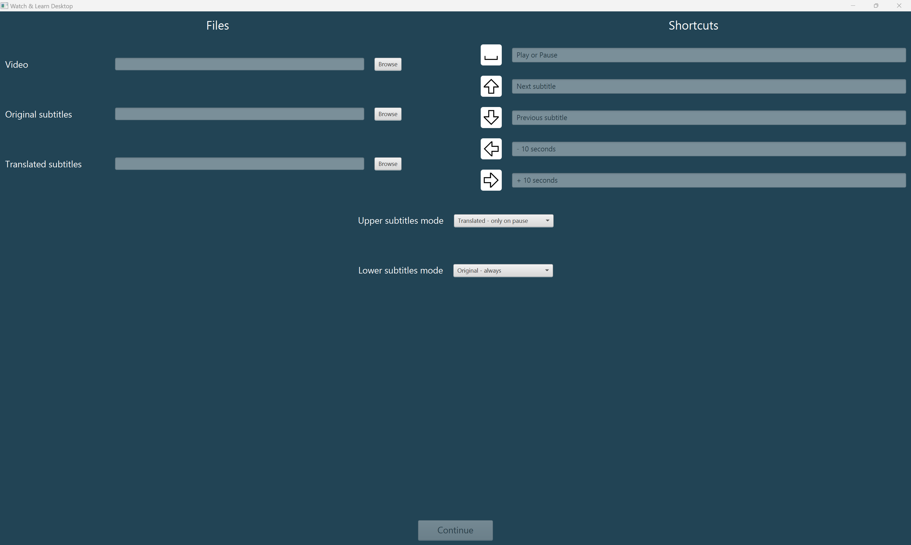

# Watch & Learn Desktop

The program supports language learning by watching movies or TV shows in a foreign language. It allows you to display subtitles in two languages simultaneously (at the top and bottom of the screen). It is also possible to show subtitles only when the video is paused, depending on the selected mode. Currently, the program supports *.mp4 files and subtitles in *.srt format.

Here are screenshots of the application:

